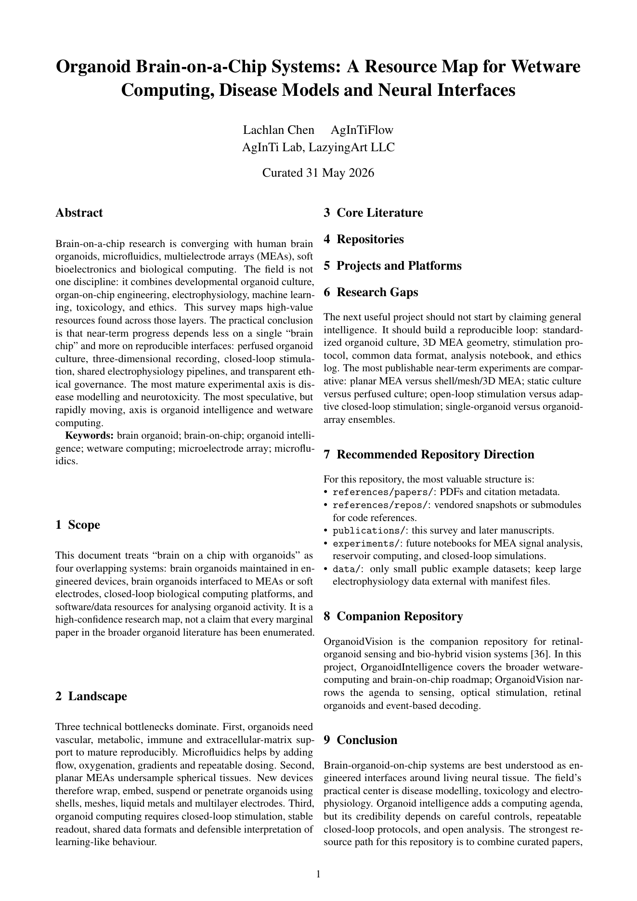
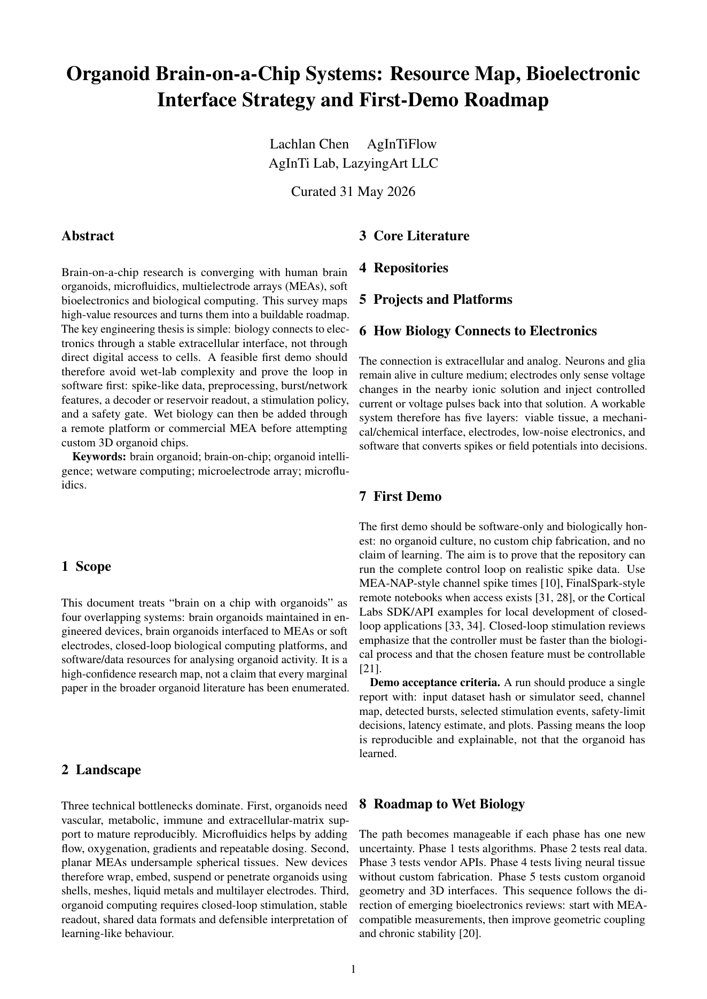

[English](README.md) · [العربية](i18n/README.ar.md) · [Español](i18n/README.es.md) · [Français](i18n/README.fr.md) · [日本語](i18n/README.ja.md) · [한국어](i18n/README.ko.md) · [Tiếng Việt](i18n/README.vi.md) · [中文 (简体)](i18n/README.zh-Hans.md) · [中文（繁體）](i18n/README.zh-Hant.md) · [Deutsch](i18n/README.de.md) · [Русский](i18n/README.ru.md)

<div align="center">

# OrganoidIntelligence

### Brain-organoid-on-chip intelligence, wetware computing, and bioelectronic roadmaps

[](https://ideas.onlyideas.art)
[](https://ideas.onlyideas.art)
[](https://ideas.onlyideas.art)
[](https://github.com/lachlanchen/OrganoidVision)

**Website:** [ideas.onlyideas.art](https://ideas.onlyideas.art)  
**GitHub:** [github.com/lachlanchen/OrganoidIntelligence](https://github.com/lachlanchen/OrganoidIntelligence)  
**Companion:** [OrganoidVision](https://github.com/lachlanchen/OrganoidVision)

</div>

---

## Vision

OrganoidIntelligence maps a practical path from brain organoids to working bioelectronic systems: microfluidic culture, MEA readout, closed-loop stimulation, wetware computing, and software-first demos.

The project is staged to make the idea less intimidating: start with papers and simulated MEA spikes, prove the closed-loop software, then move toward remote wetware platforms, commercial MEA adapters, and eventually organoid-on-chip interfaces.

## PDF Render Preview

| Resource Map | Feasibility Roadmap |
|---|---|
| [](publications/organoid-brain-on-chip-resource-map.pdf) | [](publications/organoid-brain-on-chip-feasibility-roadmap.pdf) |
| [Open PDF](publications/organoid-brain-on-chip-resource-map.pdf) | [Open PDF](publications/organoid-brain-on-chip-feasibility-roadmap.pdf) |

## Repository Map

| Path | Purpose |
|---|---|
| `references/` | Papers, repositories, and supporting research material |
| `publications/` | Nature-style survey and feasibility roadmap PDFs |
| `publications/figures/` | High-quality figures in SVG, PDF, and PNG |
| `publications/previews/` | Rendered first-page previews for GitHub README display |
| `i18n/` | Multilingual README pages |

## Publications

- [Resource Map](publications/organoid-brain-on-chip-resource-map.pdf)
- [Feasibility Roadmap](publications/organoid-brain-on-chip-feasibility-roadmap.pdf)

## Companion: OrganoidVision

[OrganoidVision](https://github.com/lachlanchen/OrganoidVision) explores retinal organoids and bio-hybrid vision systems: organoid sensors, optical stimulation, microfluidic interfaces, and event-based decoding.

Use the two projects together:

| Repository | Role |
|---|---|
| [OrganoidIntelligence](https://github.com/lachlanchen/OrganoidIntelligence) | Broad brain-on-chip and wetware-computing roadmap |
| [OrganoidVision](https://github.com/lachlanchen/OrganoidVision) | Concrete retinal-organoid sensing and vision branch |

## How to Cite

If you use this repository, cite the roadmap paper:

```bibtex
@misc{chen2026organoidintelligence,
  title        = {Organoid Brain-on-a-Chip Systems: Resource Map, Bioelectronic Interface Strategy and First-Demo Roadmap},
  author       = {Chen, Lachlan and AgInTiFlow},
  year         = {2026},
  institution  = {AgInTi Lab, LazyingArt LLC},
  howpublished = {\url{https://github.com/lachlanchen/OrganoidIntelligence}},
  note         = {Research roadmap and repository}
}
```

For the resource-map manuscript:

```bibtex
@misc{chen2026organoidbrainchipmap,
  title        = {Organoid Brain-on-a-Chip Systems: A Resource Map for Wetware Computing, Disease Models and Neural Interfaces},
  author       = {Chen, Lachlan and AgInTiFlow},
  year         = {2026},
  institution  = {AgInTi Lab, LazyingArt LLC},
  howpublished = {\url{https://github.com/lachlanchen/OrganoidIntelligence}},
  note         = {Research survey and curated resource map}
}
```

For the companion OrganoidVision project:

```bibtex
@misc{chen2026organoidvision,
  title        = {OrganoidVision: Bio-Hybrid Retinal Organoids as Living Event-Based Imaging Sensors},
  author       = {Chen, Lachlan and AgInTiFlow},
  year         = {2026},
  institution  = {AgInTi Lab, LazyingArt LLC},
  howpublished = {\url{https://github.com/lachlanchen/OrganoidVision}},
  note         = {Companion research manuscript and repository}
}
```

## Topics

`OrganoidIntelligence` · `organoid-intelligence` · `brain-on-chip` · `wetware-computing` · `bioelectronics` · `microelectrode-array` · `organoid-on-chip` · `closed-loop-stimulation` · `neurotechnology` · `biocomputing` · `brain-organoids` · `AgInTiFlow`

## Authors

**Lachlan Chen** and **AgInTiFlow**  
**AgInTi Lab, LazyingArt LLC**
